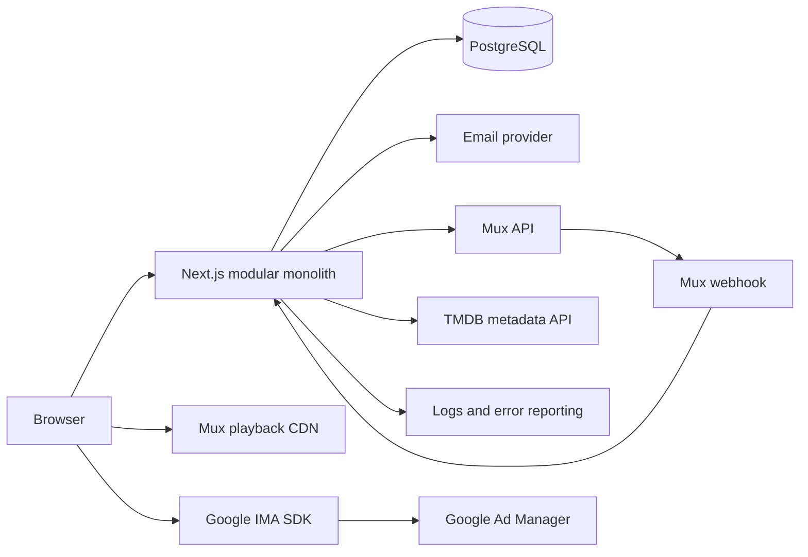

# System Architecture

Status: **Approved baseline for MVP**

## Architectural Shape

Build a **modular monolith** in one Next.js application and one PostgreSQL database. This gives the MVP atomic transactions, one deployment, and simple local development while preserving module boundaries that can be extracted later. Do not introduce microservices, queues, Redis, or a separate search engine until a measured requirement justifies them through an ADR.

Server Components render read-heavy pages. Route Handlers serve browser-side runtime requests and provider webhooks. Server Actions handle progressively enhanced form mutations. All transports call the same application services; no route or component owns business rules.

## Technology Baseline

Pin exact versions in `package.json` and `pnpm-lock.yaml` when scaffolding. Use current stable releases that support the following baseline.

| Concern | Decision |
|---|---|
| Runtime and package manager | Active Node.js LTS, Corepack, pnpm |
| Web framework | Next.js App Router, React, strict TypeScript |
| Styling | Tailwind CSS v4 plus CSS custom properties from the normalized design system |
| UI primitives | Radix primitives for complex accessible behavior; Lucide for icons |
| Database | PostgreSQL |
| ORM and migrations | Prisma with checked-in migrations |
| Validation | Zod at environment, action, HTTP, and provider boundaries |
| Authentication | Auth.js database sessions with email-link sign-in |
| Video | Mux Video and Mux Player through a `VideoProvider` adapter |
| Advertising | Google IMA client SDK through an `AdProvider` adapter; Google Ad Manager VAST in production |
| Metadata | TMDB API through a server-only `MetadataProvider` adapter |
| Unit/integration tests | Vitest, Testing Library, and database-backed repository tests |
| Browser tests | Playwright with deterministic provider fakes |
| Observability | Structured server logs and Sentry-compatible error reporting adapter |
| Deployment target | Vercel-compatible web runtime, managed PostgreSQL, Mux |

Use managed provider SDKs for video and advertising behavior. Do not hand-roll an HLS parser, transcoder, ad state machine, auth protocol, or media player.

## Locale And Routes

MVP has one locale: Turkish (`tr-TR`). Do not add an i18n runtime dependency or a locale URL prefix. Public paths stay Turkish (`/filmler`, `/arama`, `/film/[slug]`, `/izle/[slug]`), while source-code identifiers, database names, and telemetry event names stay English.

- Render `<html lang="tr">` and use UTF-8 everywhere.
- Format user-visible dates and numbers through shared wrappers around `Intl.DateTimeFormat('tr-TR')` and `Intl.NumberFormat('tr-TR')`; do not rely on server defaults.
- Keep reusable UI copy in module-owned Turkish message files rather than duplicating literals across components.
- Provider/admin status values remain owned enums and map to Turkish display copy at the UI boundary.
- Adding a second locale requires an ADR covering URL strategy, message tooling, metadata, data localization, and migration.

## System Context



The browser receives only short-lived playback authorization and public provider identifiers. Mux signing secrets, webhook secrets, database credentials, email credentials, and provider management tokens remain on the server.

## Module Boundaries

| Module | Owns | May depend on |
|---|---|---|
| `catalog` | Films, genres, people, credits, collections, publication | shared kernel, provider ports |
| `playback` | Watchability policy, playback grants, progress | catalog public contract, identity public contract, video port |
| `advertising` | Preroll policy and sanitized ad configuration | playback public contract, ad port |
| `identity` | Sessions, profiles, roles, account lifecycle | auth adapter, shared kernel |
| `library` | Watchlist and ratings | catalog public contract, identity public contract |
| `admin` | Curator use cases and audit orchestration | public application contracts of other modules |
| `audit` | Append-only privileged-action events | identity public contract |
| `shared` | IDs, clocks, result/error types, pagination | nothing feature-specific |

Rules:

- `src/app` may compose module UI and application entry points but cannot import Prisma.
- A module cannot import another module's infrastructure or database implementation.
- Cross-module calls use an exported application service or read model, never another module's internal table access.
- Shared code must be domain-neutral. A helper mentioning films, users, playback, or ads belongs to that module.
- Provider SDK types stop at adapter boundaries; domain and application code use owned types.
- Circular module imports are architecture failures, not bundler problems to work around.

## Planned Repository Layout

Create directories only when the first real file needs them.

```text
.
|-- AGENTS.md
|-- DESIGN.md
|-- README.md
|-- docs/
|   |-- 01-PRODUCT.md ... 09-OPERATIONS.md
|   |-- adr/
|   `-- design/
|       |-- README.md
|       |-- SCREEN-BLUEPRINTS.md
|       `-- references/
|-- prisma/
|   |-- schema.prisma
|   |-- migrations/
|   `-- seed.ts
|-- public/
|   `-- brand/
|-- src/
|   |-- app/
|   |   |-- (public)/
|   |   |-- (auth)/
|   |   |-- (member)/
|   |   |-- yonetim/
|   |   `-- api/
|   |-- modules/
|   |   |-- catalog/
|   |   |-- playback/
|   |   |-- advertising/
|   |   |-- identity/
|   |   |-- library/
|   |   |-- admin/
|   |   `-- audit/
|   |-- shared/
|   |   |-- config/
|   |   |-- db/
|   |   |-- i18n/
|   |   |-- observability/
|   |   `-- ui/
|   `-- styles/
|-- tests/
|   |-- e2e/
|   |-- fixtures/
|   `-- setup/
`-- package.json
```

A module starts small and grows only as needed:

```text
src/modules/catalog/
|-- domain/          # Pure entities, policies, and owned types
|-- application/     # Commands, queries, ports, and use cases
|-- infrastructure/  # Prisma and provider adapter implementations
|-- ui/              # Module-owned server/client components
`-- index.ts          # Deliberate public exports only
```

Do not generate empty layer folders or generic `utils.ts` files.

## Request And Data Flow

### Catalog Read

1. A Server Component parses URL input with a module schema.
2. A catalog query service obtains a purpose-built read model through its repository port.
3. The page renders serializable view data, not Prisma records.
4. Public catalog responses may be cached and tagged by film or collection ID.

### Playback Start

1. The watch page requests `POST /api/v1/playback/sessions` with a film ID.
2. A `TerritoryResolver` obtains a country from trusted deployment geolocation context. Production never falls back when that context is absent; local/test may use an explicit non-production default.
3. The playback service evaluates publication, rights territory and time, asset state, and optional member context using one server clock.
4. The video adapter creates a short-lived signed playback token.
5. The advertising service adds at most one consent-aware preroll configuration.
6. The browser receives a narrow playback-session response; it never receives provider management credentials.

`TerritoryResolver` is an owned server port. The first production adapter uses Vercel's trusted geolocation API/context rather than accepting a raw country header from application input. `SUPPORTED_TERRITORIES` is validated at startup as ISO 3166-1 alpha-2 codes. `LOCAL_DEFAULT_TERRITORY=TR` is allowed only outside production. Missing, malformed, or unsupported production territory fails closed as `PLAYBACK_NOT_AVAILABLE`.

### Provider Webhook

1. Read the raw request body and verify the Mux signature before parsing trusted fields.
2. Deduplicate by provider event ID.
3. Translate provider state into owned asset states in a transaction.
4. Return quickly. Unsupported event types are acknowledged and logged at debug level.

### Scheduled Publication

1. Vercel Cron invokes a same-application internal Route Handler every minute with a dedicated `CRON_SECRET` bearer credential.
2. The handler calls the idempotent `PublishDueMovies` application command; it does not contain publication logic.
3. The command selects due `SCHEDULED` films, re-evaluates completeness and current watchability prerequisites, and publishes each film in its own short transaction with a system audit event.
4. A failed film remains `SCHEDULED`, records a safe operational reason, and is retried on a later run without blocking other due films.

This scheduled Route Handler is part of the modular monolith, not a separate worker or queue. Manual publication remains available through the same publication policy.

### Account Retention

1. Vercel Cron invokes `/api/internal/run-retention` daily with the same internal-job authentication pattern.
2. The bounded `PurgeDeletedAccounts` command claims deletion requests at least 30 days old, rechecks disabled/deleted state, and processes each account transactionally.
3. The command removes Auth.js identity/session/verification data and member-owned rows, unlinks the nullable audit actor, and retains only the deletion marker needed to replay the purge after a backup restore.
4. Duplicate or overlapping runs are idempotent; one failed account does not block the remaining batch.

## Rendering And Client State

- Default to Server Components. Add `use client` only at the smallest interactive boundary.
- Catalog filters and sorting live in the URL, not a global client store.
- Authentication state comes from the server session. Do not mirror the full user object into local storage.
- Player time and ad lifecycle are local ephemeral state. Persist member progress at a throttled interval and on pause, visibility loss, and page exit.
- Use optimistic UI only for reversible member actions such as watchlist toggles and ratings; reconcile with the server result.
- Use native browser and framework image optimization behavior with explicit dimensions or aspect ratios to prevent layout shift.

## Provider Ports

Provider-specific code implements owned interfaces:

```ts
interface VideoProvider {
  createPlaybackGrant(input: PlaybackGrantInput): Promise<PlaybackGrant>;
  getAsset(externalAssetId: string): Promise<VideoAssetSnapshot>;
  verifyWebhook(rawBody: string, headers: Headers): VerifiedVideoEvent;
}

interface MetadataProvider {
  searchMovies(query: string): Promise<MetadataSearchResult[]>;
  getMovie(externalId: string): Promise<ImportedMovieMetadata>;
}
```

The ad adapter is intentionally client-facing but receives only a sanitized `AdConfig` from the server. Domain code does not import Google IMA types.

## Caching And Freshness

- Published catalog pages may use tagged server caching.
- Search suggestions use a short cache keyed by normalized query and filters.
- Rights, playback grants, sessions, roles, progress, watchlist, ratings, admin previews, and draft content are never served from a public shared cache.
- Publication, unpublication, rights, asset, or collection changes invalidate affected catalog tags after transaction commit.
- PostgreSQL full-text and trigram search are sufficient for MVP. A search service requires measured latency or relevance evidence and an ADR.

## Reliability Rules

- Pass an injectable clock into rights and scheduling policies so boundary-time tests are deterministic.
- Use database uniqueness plus idempotency keys for webhook and retry-prone mutations.
- Set explicit timeouts on provider calls. Retry only idempotent operations with bounded exponential backoff.
- An ad failure is fail-open for content playback. A rights, authz, or playback-signing uncertainty is fail-closed.
- Return stable owned errors from application services; translate them at the transport boundary.
- Log request IDs, stable entity IDs, action names, durations, and coarse outcomes. Never log tokens, ad URLs, email-link tokens, raw webhooks, or full email addresses.

## Architecture Change Rule

The following require an accepted ADR before implementation: a new runtime dependency category, a new managed service, a database or ORM change, a module-boundary exception, a public API compatibility break, a new authentication method, a new advertising format, or moving video processing in-house.
