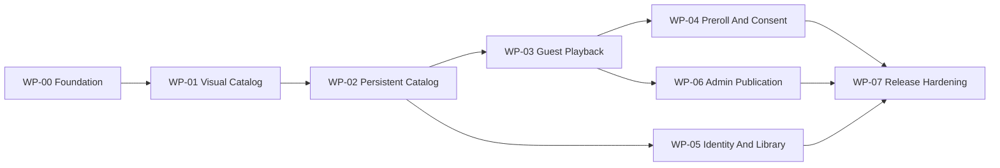

# Delivery Plan

Status: **Execution source of truth**  
Active work package: **WP-06 Admin Publication And Audit**

## Execution Rules

- Work on only the active package unless the owner explicitly changes priority.
- Complete a vertical, demonstrable outcome; do not prebuild abstractions for later packages.
- A checkbox is complete only when its repository evidence exists and the package validation passes.
- Record evidence links and command results in the package's `Evidence` section before activating the next package.
- Any change to product scope, stack, provider, module boundary, or release gate first updates the relevant document and, when required, an ADR.
- Production credentials, real user data, unlicensed assets, and live ad tags are never prerequisites for local or CI completion.

## Dependency Order

WP-05 and WP-06 may proceed in parallel only after their prerequisites pass and the owner explicitly splits work between agents. A single agent handles one package at a time.

## WP-00 Foundation

**Outcome:** A production-shaped, empty Next.js application can be installed, checked, tested, built, and connected to an isolated PostgreSQL database.

### Scope

- [x] Scaffold current stable Next.js App Router with strict TypeScript and pnpm.
- [x] Pin Node/pnpm requirements and commit the lockfile.
- [x] Configure Tailwind CSS v4 and the canonical color/type/spacing tokens.
- [x] Load DM Sans and Source Serif 4 through `next/font/google` at weights 400/700 with swap behavior and Turkish glyph coverage; verify there is no runtime Google Fonts request.
- [x] Configure the single `tr-TR` locale, `<html lang="tr">`, Turkish routes without a locale prefix, and shared deterministic `Intl` formatters; do not add an i18n library.
- [x] Add ESLint, formatting, typecheck, Vitest, Testing Library, and Playwright foundations.
- [x] Add Prisma/PostgreSQL with an initial connection check but no speculative feature tables.
- [x] Add strict server/public environment parsing and a placeholder-only `.env.example`.
- [x] Create health routes, request ID propagation, structured redacted logging, and base Problem Details helpers.
- [x] Add CI for frozen install, lint, typecheck, unit test, database check, build, and one browser smoke test.
- [x] Create the documented module and route directories only when they receive a real file.
- [x] Add a minimal app shell that proves fonts, tokens, metadata, not-found, and global error handling.

### Acceptance

- A clean checkout succeeds with the documented local setup.
- `pnpm lint`, `pnpm typecheck`, `pnpm test`, `pnpm build`, and the smoke test pass.
- `pnpm db:check` proves an isolated PostgreSQL connection and migration status.
- The browser renders a responsive dark shell at 360x800 and 1440x900 with no console or accessibility errors.
- Client bundles contain no server-only environment value.

### Evidence

- Application/toolchain: [`package.json`](../package.json), [`src/app/layout.tsx`](../src/app/layout.tsx), [`src/app/globals.css`](../src/app/globals.css), and [`.github/workflows/ci.yml`](../.github/workflows/ci.yml).
- Configuration/HTTP boundaries: [`.env.example`](../.env.example), [`src/proxy.ts`](../src/proxy.ts), [`src/shared/http/problem-details.ts`](../src/shared/http/problem-details.ts), and health handlers under [`src/app/api/health`](../src/app/api/health).
- Database: [`compose.yaml`](../compose.yaml), [`prisma/schema.prisma`](../prisma/schema.prisma), the empty foundation migration, and PostgreSQL integration coverage in [`tests/integration/database-foundation.test.ts`](../tests/integration/database-foundation.test.ts).
- Browser evidence: [360x800 shell](../tests/e2e/__screenshots__/chromium-mobile/foundation-shell.png) and [1440x900 shell](../tests/e2e/__screenshots__/chromium-desktop/foundation-shell.png), exercised by [`tests/e2e/foundation.spec.ts`](../tests/e2e/foundation.spec.ts).
- Local validation on 2026-07-18: frozen install passed; formatting, lint, and strict typecheck passed; 15 unit/component tests passed; coverage passed at 88.7% statements, 82.85% branches, 90% functions, and 90% lines; 2 PostgreSQL integration tests passed; `db:check` reported one applied migration and current schema; production build passed; 6 Playwright checks passed across both required viewports with no serious/critical axe violations, browser console errors, Google Fonts requests, horizontal overflow, or server-sentinel leakage.
- Security/content impact: no provider or production secret is required or committed; only `NEXT_PUBLIC_SITE_NAME` reaches browser configuration; no film, artwork, playback URL, or feature table exists in WP-00.
- Remote validation: GitHub Actions [CI run 29649763811](https://github.com/onatozmenn/film-platformu/actions/runs/29649763811) passed on Node 24 and PostgreSQL 18.3 for commit `9ab7795`, including frozen install, formatting, lint, typecheck, unit, integration, database, build, and browser gates.

## WP-01 Visual Catalog With Deterministic Fixtures

**Outcome:** Visitors can navigate a polished, responsive home, catalog, search, and film-detail experience using fictional deterministic data.

### Scope

- [x] Build navigation, mobile menu, search layer, footer, buttons, poster item, badges, rating display, state patterns, and image placeholders.
- [x] Build the photographic hero using an explicitly licensed/local fixture and preserve a hint of the next section.
- [x] Build home rows, responsive poster grid, URL-driven catalog filters, search results/suggestions, and film detail.
- [x] Add loading, empty, partial, error, unavailable, offline, keyboard, and reduced-motion behavior.
- [x] Add responsive screenshots and accessibility tests from `docs/05-DESIGN-SYSTEM.md` and `docs/design/SCREEN-BLUEPRINTS.md`.
- [x] Keep all data behind a catalog query port so fixtures can be replaced in WP-02.

### Acceptance

- Home, catalog, search, and detail match Midnight Programme in root `DESIGN.md`, the route composition in `docs/design/SCREEN-BLUEPRINTS.md`, and the executable constraints in `docs/05-DESIGN-SYSTEM.md` at required viewports.
- Search and filters are keyboard operable, URL-backed, and refresh-safe.
- No route loads player, Mux, IMA, auth, or admin code.
- Visual regression, component, accessibility, lint, typecheck, and build checks pass.

### Evidence

- Query boundary and deterministic fixtures: [`src/modules/catalog/application/catalog-query-port.ts`](../src/modules/catalog/application/catalog-query-port.ts), [`src/modules/catalog/application/catalog-queries.ts`](../src/modules/catalog/application/catalog-queries.ts), and [`src/modules/catalog/infrastructure/fixture-catalog-query.ts`](../src/modules/catalog/infrastructure/fixture-catalog-query.ts).
- Public routes and UI: [`src/app/(public)`](<../src/app/(public)>), [`src/modules/catalog/ui`](../src/modules/catalog/ui), and the strict suggestion handler at [`src/app/api/v1/search/suggestions/route.ts`](../src/app/api/v1/search/suggestions/route.ts).
- Local imagery: four vendored Library of Congress photographs with source/right statements in [`public/fixtures/catalog/ATTRIBUTION.md`](../public/fixtures/catalog/ATTRIBUTION.md); six films deliberately exercise the typographic missing-art placeholder.
- Representative visual evidence: [mobile home](../tests/e2e/__screenshots__/chromium-mobile/home-discovery.png), [desktop home](../tests/e2e/__screenshots__/chromium-desktop/home-discovery.png), [mobile filter sheet](../tests/e2e/__screenshots__/chromium-mobile/catalog-filter-sheet.png), [empty catalog](../tests/e2e/__screenshots__/chromium-desktop/catalog-empty.png), [search suggestions](../tests/e2e/__screenshots__/chromium-mobile/search-suggestions.png), [search results](../tests/e2e/__screenshots__/chromium-desktop/search-results.png), [long unavailable detail](../tests/e2e/__screenshots__/chromium-mobile/detail-long-unavailable.png), [partial detail](../tests/e2e/__screenshots__/chromium-desktop/detail-partial.png), [ranked rail](../tests/e2e/__screenshots__/chromium-desktop/rail-ranked.png), and [focused rail end](../tests/e2e/__screenshots__/chromium-desktop/rail-end-focus.png). Tablet and wide equivalents are committed beside them.
- Local validation on 2026-07-18: frozen install, formatting, zero-warning lint, strict typecheck, and production build passed; 49 unit/component/route tests passed; coverage passed at 85.63% statements, 77.15% branches, 86.46% functions, and 86.01% lines; 2 PostgreSQL foundation tests and `db:check` passed; 34 Playwright checks passed across 360x800, 768x1024, 1440x900, and 1920x1080 with 10 intentional viewport skips.
- Accessibility/state evidence: axe reported no serious/critical issue; browser checks cover keyboard suggestions, responsive sheets, focus return, rail beginning/middle/end/rank/focus, 320 CSS-pixel long-title fit, reduced motion, offline content preservation, loading/empty/partial/unavailable states, image load, and horizontal overflow.
- Performance/bundle evidence: [`scripts/check-client-budgets.ts`](../scripts/check-client-budgets.ts) measured actual production Chromium requests at 160.2 KB gzip JavaScript and 7.4 KB gzip CSS for home, catalog, search, and detail. Public bundle checks found no Mux Player, Google IMA, or Auth.js code.
- Security/content impact: URL, slug, suggestion limit, and API payload boundaries are validated; search suggestions expose only the owned public contract; all fixture films/people are fictional; no provider ID, stream, production credential, feature table, or arbitrary remote image URL was added.
- Known WP-02 boundary: public reads still use the fixture adapter; catalog persistence, publication visibility policy, database search, cache tags, and TMDB adapter remain blocked until WP-01 remote CI passes and WP-02 activates.
- Remote validation: GitHub Actions [CI run 29656587853](https://github.com/onatozmenn/film-platformu/actions/runs/29656587853) passed on Node 24 and PostgreSQL 18.3 for commit `91d5f59`, including frozen install, formatting, lint, typecheck, unit/coverage, integration, database, production build, public-route asset budgets, and the four-viewport browser suite.

## WP-02 Persistent Catalog And Search

**Outcome:** Public discovery reads published catalog data from PostgreSQL with deterministic seeds and cache invalidation boundaries.

### Scope

- [x] Implement catalog schema, migrations, constraints, indexes, and fictional seed data from `docs/03-DOMAIN-AND-DATA.md`.
- [x] Implement catalog repositories, read models, publication visibility policy, pagination, filters, and PostgreSQL title/person search.
- [x] Replace UI fixtures through the existing query port without changing page contracts.
- [x] Add TMDB metadata adapter behind a disabled-by-default server configuration using provider test fixtures.
- [x] Add public cache tags and invalidation service boundaries; keep draft and member data uncached.
- [x] Add empty-to-current migration tests and repository/query integration tests.

### Acceptance

- Draft and scheduled content never appears in public rows, search, sitemap, or metadata.
- Seeded public journeys behave identically through database-backed queries.
- Search relevance and p95 fixture performance meet the documented budget.
- Migrations, constraints, integration tests, lint, typecheck, build, and browser discovery journey pass.

### Evidence

- Persistence and seed: [`prisma/schema.prisma`](../prisma/schema.prisma), [`prisma/migrations/20260718185925_persistent_catalog/migration.sql`](../prisma/migrations/20260718185925_persistent_catalog/migration.sql), and [`prisma/seed.ts`](../prisma/seed.ts) define the additive catalog model, reviewed PostgreSQL checks/indexes, ten public fictional films, and four concealed lifecycle fixtures.
- Public query path: [`src/modules/catalog/infrastructure/prisma-catalog-query.ts`](../src/modules/catalog/infrastructure/prisma-catalog-query.ts) applies one publication predicate to home, catalog, detail, title/original-title/person search, and suggestions; [`src/shared/pagination/page.ts`](../src/shared/pagination/page.ts) bounds catalog/search pages at 24 records while preserving validated URL state.
- Provider/cache boundaries: [`src/modules/catalog/application/metadata-provider-port.ts`](../src/modules/catalog/application/metadata-provider-port.ts), the synthetic-fixture-tested TMDB adapter, disabled factory, server composition, public cache tags, and [`src/modules/catalog/infrastructure/next-catalog-cache.ts`](../src/modules/catalog/infrastructure/next-catalog-cache.ts). `TMDB_ENABLED` defaults to `false`; token presence alone cannot make a request.
- Database evidence: [`tests/integration/catalog-migration.test.ts`](../tests/integration/catalog-migration.test.ts) replays empty-to-current migration in an isolated schema; [`tests/integration/catalog-repository.test.ts`](../tests/integration/catalog-repository.test.ts) covers hidden lifecycle states, constraints/indexes, deterministic mapping, bounded pagination, title/original-title/person relevance, and warm suggestion p95 below 250 ms.
- Local validation on 2026-07-18: formatting, zero-warning lint, strict typecheck, and production build passed; 69 unit/component/provider tests passed; 10 PostgreSQL migration/repository tests passed after deterministic reseeding; `db:check` reported two applied migrations and current schema; 38 Playwright checks passed across four viewports with 10 intentional skips; production routes measured 160.3 KB gzip JavaScript and 7.4 KB gzip CSS against 180/60 KB budgets.
- Migration/operations impact: the migration is additive, enables `pg_trgm` in `public`, and needs no data backfill from the empty WP-00 schema. Constraint/index failures use a forward-fix migration; production rollout should observe migration lock duration and search latency. The supported test command now migrates and deterministically reseeds only a database ending in `_test`.
- Security/content impact: draft, scheduled, future-publish, and unpublished records are absent from rows, search, suggestions, metadata, sitemap, and detail responses; hidden detail transport returns HTTP 404. TMDB accepts numeric IDs rather than arbitrary URLs, stores provider paths rather than credentials, uses a server-only authorization header, and exposes only coarse typed failures. No live provider call, production token, unlicensed image, or stream is required.
- Remote validation: GitHub Actions [CI run 29661927266](https://github.com/onatozmenn/film-platformu/actions/runs/29661927266) passed on Node 24 and PostgreSQL 18.3 for commit `4530ff6`, including frozen install, formatting, lint, typecheck, 69 unit/component/provider tests, 10 migration/repository integration tests, database state, production build, public-route budgets, and the four-viewport browser suite.

## WP-03 Licensed Guest Playback

**Outcome:** A visitor can play a watchable seeded film through Mux signed playback without an account.

### Scope

- [x] Implement video asset, subtitle, content-right, and webhook-idempotency records and migrations.
- [x] Implement pure watchability policy with injected clock and trusted territory resolver.
- [x] Implement `VideoProvider`, Mux adapter, deterministic fake, playback-session endpoint, and private/no-store response policy.
- [x] Build the 16:9 watch experience with Mux Player, captions, loading, denied, provider-error, and retry behavior.
- [x] Implement verified/idempotent Mux webhook state mapping.
- [x] Add token-leak, rights-boundary, territory, asset-state, webhook, CSP, and player browser tests.

### Acceptance

- All watchability policy branches pass, including exact time boundaries.
- Eligible visitor playback works with provider fake and staging Mux; ineligible playback fails closed with safe copy.
- Signed grants expire within policy and never appear in logs, URL, analytics, or persistent browser storage.
- Invalid or duplicate webhooks cannot corrupt asset state.
- Watch-page accessibility, responsive screenshots, nonblank-player checks, lint, typecheck, tests, and build pass.

### Evidence

- Persistence and policy: [`prisma/migrations/20260718215331_licensed_guest_playback/migration.sql`](../prisma/migrations/20260718215331_licensed_guest_playback/migration.sql) adds assets, subtitle tracks, rights, and webhook IDs with partial uniqueness, active-ready, valid-window, and contradictory-overlap constraints. [`src/modules/playback/domain/watchability.ts`](../src/modules/playback/domain/watchability.ts) owns publication, trusted-territory, half-open rights, and active-ready policy using one injected clock.
- Application/provider boundaries: [`src/modules/playback/application/create-playback-session.ts`](../src/modules/playback/application/create-playback-session.ts) caps grants at five minutes and the rights end, bounds signing at two seconds, and creates opaque nonpersisted sessions. The owned port has deterministic fake and official Mux SDK adapters; synthetic RSA/HMAC contracts cover signed JWT claims, raw-body signatures, exact 300-second skew, malformed data, and coarse failures without committed credentials.
- Routes and UI: [`src/app/api/v1/playback/sessions/route.ts`](../src/app/api/v1/playback/sessions/route.ts) strictly accepts only `movieId`, validates same origin/host, applies a bounded request budget, resolves territory server-side, and returns private no-store sessions. [`src/app/api/webhooks/mux/route.ts`](../src/app/api/webhooks/mux/route.ts) bounds and verifies raw bodies. [`src/app/(watch)/izle/[slug]/page.tsx`](<../src/app/(watch)/izle/[slug]/page.tsx>) and [`src/modules/playback/ui`](../src/modules/playback/ui) provide the route-isolated 16:9 player, captions, loading, denied, failure, and explicit retry states with no autoplay.
- Deterministic media: [`public/fixtures/playback/ATTRIBUTION.md`](../public/fixtures/playback/ATTRIBUTION.md) records the original FFmpeg test pattern/audio and Turkish WebVTT fixture. It contains no film footage, third-party music, provider ID, or personal data and is disabled as a production grant source.
- Database evidence: 16 PostgreSQL tests cover empty-to-current replay, exact active/default constraints, contradictory rights, seeded eligible/expired/draft mapping, verified unknown assets, duplicate delivery, and monotonic CREATED/READY/ERRORED/DISABLED transitions. The test seed wrapper now forces its validated `_test` URL into both database variables, preventing persistent shell state from targeting development.
- Local validation on 2026-07-19: formatting, zero-warning lint, strict typecheck, and production build passed; 127 unit/component/route/provider tests passed; coverage passed at 85.5% statements, 76.48% branches, 86.8% functions, and 85.85% lines, with watchability at 100% statements/branches/functions/lines and 22/22 branches; `db:check` reported three applied migrations and current schema; 47 Playwright checks passed across four viewports with 21 intentional skips; non-watch routes remained at 160.3 KB gzip JavaScript and 7.7 KB gzip CSS.
- Visual/accessibility evidence: [mobile playing with captions](../tests/e2e/__screenshots__/chromium-mobile/watch-ready.png), [desktop playing with captions](../tests/e2e/__screenshots__/chromium-desktop/watch-ready.png), [mobile loading](../tests/e2e/__screenshots__/chromium-mobile/watch-loading.png), [desktop loading](../tests/e2e/__screenshots__/chromium-desktop/watch-loading.png), [mobile unavailable](../tests/e2e/__screenshots__/chromium-mobile/watch-unavailable.png), and [desktop unavailable](../tests/e2e/__screenshots__/chromium-desktop/watch-unavailable.png). Browser checks prove nonblank media pixels, native controls, text tracks, axe, responsive fit, and stable request-ID support copy.
- Security/content impact: caller territory/consent/asset/provider fields are rejected; untrusted geo headers are ignored; missing production territory and provider uncertainty fail closed; grants are absent from app URLs, storage, logs, and client bundles; Mux credentials remain server-only; direct draft detail/watch routes return HTTP 404; CSP names explicit Mux media/image origins in report-only rollout without wildcard sources.
- External provider evidence: no operator staging Mux credentials were available, so a live staging asset/grant was not invoked. The official SDK path is cryptographically contract-tested and production stays unavailable until `VIDEO_PROVIDER=mux` plus the complete credential set is supplied.
- Remote validation: GitHub Actions [CI run 29664525875](https://github.com/onatozmenn/film-platformu/actions/runs/29664525875) passed on Node 24 and PostgreSQL 18.3 for commit `6ef147c`, including frozen install, migrations, formatting, lint, typecheck, 127 unit/component/provider tests, 16 PostgreSQL tests, database state, production build, public-route budgets, and the four-viewport browser suite.

## WP-04 Preroll Advertising And Consent

**Outcome:** An eligible playback session offers at most one consent-aware Google IMA preroll and always reaches content when the ad path is unavailable.

### Scope

- [ ] Record the legally reviewed consent-management decision in a new ADR before production behavior is enabled.
- [x] Implement owned ad-decision types, server-side sanitized configuration, Google IMA adapter, and deterministic fake.
- [x] Load ad code only after consent and only on the watch route.
- [x] Implement personalized-denied mode, test-tag environments, empty-ad/error/timeout/blocked paths, and no-retry rule.
- [x] Add coarse privacy-safe ad outcome telemetry and CSP updates.
- [x] Add consent, storage, fail-open, bundle-boundary, and browser player/ad handoff tests.

### Acceptance

- Missing or denied advertising consent initializes no optional ad request/storage.
- Non-personalized consent produces only the approved request mode.
- No playback session gets more than one preroll opportunity; no midroll/postroll/overlay exists.
- Every ad failure path reaches eligible content without a loop or blank player.
- Production ad tags cannot load in local, test, or preview environments.

### Evidence

- Consent and decision policy: [`src/modules/advertising/domain/preroll-policy.ts`](../src/modules/advertising/domain/preroll-policy.ts) maps owned `UNKNOWN`, `DENIED`, `NON_PERSONALIZED`, and `PERSONALIZED` states to zero or one preroll, with separate sanitized `npa=1` and personalized tags. [`src/modules/advertising/infrastructure/advertising-environment.ts`](../src/modules/advertising/infrastructure/advertising-environment.ts) defaults off and rejects every non-disabled production configuration.
- Provider and player handoff: the non-production fake builds only Google's published sample tag and deterministic completed/empty/error/timeout/blocked outcomes. [`src/modules/advertising/ui/consent-aware-watch-player.tsx`](../src/modules/advertising/ui/consent-aware-watch-player.tsx) strictly validates the provider host/path and personalization mode, dynamically loads ad code after consent, uses Mux Player's managed Google IMA `adTagUrl` integration, and returns every failure path to the existing content grant without another session request. The watch route composes that advertising-owned orchestrator into playback's presentation-only screen, preserving the documented module dependency direction.
- Privacy and transport: [`src/app/api/v1/advertising/outcomes/route.ts`](../src/app/api/v1/advertising/outcomes/route.ts) accepts only a bounded same-origin opaque session ID and coarse outcome, applies its own request budget, logs only request ID plus outcome, and returns private `204`. The session route resolves advertising only after a successful playback grant and fails open to `advertising: null` on consent/provider uncertainty.
- Browser and visual evidence: 54 Playwright checks passed across four viewports with 38 intentional skips. Denied consent produced no optional provider request, telemetry, or storage; non-personalized consent produced only a fixed `npa=1` sample tag, one preroll, one outcome, and one playback session; completed/empty/error/timeout/blocked paths all reached nonblank content. Reviewed [mobile preroll](../tests/e2e/__screenshots__/chromium-mobile/watch-preroll.png) and [desktop preroll](../tests/e2e/__screenshots__/chromium-desktop/watch-preroll.png) baselines preserve 16:9 framing, responsive fit, and axe compliance.
- Local validation on 2026-07-19: formatting, zero-warning lint, strict typecheck, and production build passed; 171 unit/component/route/provider tests passed; aggregate coverage passed at 85.24% statements, 77.94% branches, 85.9% functions, and 85.72% lines; file-scoped 100% gates passed for preroll policy and watchability; 16 PostgreSQL tests and `db:check` passed; non-watch routes remained at 160.3 KB gzip JavaScript and 8.0 KB gzip CSS.
- Security/content impact: client-body consent remains rejected; arbitrary/mismatched tag URLs fail closed before optional code loads; no title, movie ID, user data, history, provider URL, production tag, cookie, or local/session storage value enters ad telemetry. Report-only CSP adds explicit IMA/Google Ads origins without wildcard sources, and non-watch bundle checks contain no Mux, IMA, or ad-tag identifiers.
- External decision: [ADR 0004](adr/0004-production-consent-selection-gate.md) is intentionally `Proposed`; it records candidate approaches and the enforced production-disabled gate, not a CMP selection or legal approval. The owner/legal reviewer has not supplied launch-territory consent policy, CMP representation, production Google Ad Manager tag, or `ads.txt` values, so the first scope item and production advertising remain blocked without fabricated evidence.
- Remote validation: GitHub Actions [CI run 29666009878](https://github.com/onatozmenn/film-platformu/actions/runs/29666009878) passed on Node 24 and PostgreSQL 18.3 for commit `6388bbf`, including frozen install, migrations, formatting, lint, typecheck, 171 unit/component/route/provider tests, 16 PostgreSQL tests, database state, production build, public-route budgets, and the 54-pass four-viewport browser suite. The external ADR/legal decision remains open and still blocks production advertising and WP-07 completion; independently unblocked WP-05 is active.

## WP-05 Optional Identity And Member Library

**Outcome:** A visitor may become a member and synchronize watchlist, half-star ratings, and viewing progress without changing guest playback eligibility.

### Scope

- [x] Implement Auth.js database sessions and a testable email-link provider adapter.
- [x] Implement profile/role, watchlist, rating, and progress schemas, constraints, repositories, and services.
- [x] Build sign-in callback/error, account, list, rating, continue-watching, clear-history, and sign-out experiences.
- [x] Implement throttled progress writes plus pause/visibility/page-exit flush behavior.
- [x] Implement immediate session revocation/account disablement, irreversible deletion requests, the idempotent 30-day purge command, and authenticated `/api/internal/run-retention` transport.
- [x] Add ownership, CSRF, stale-progress, completion, idempotency, session, privacy, accessibility, and member browser tests.

### Acceptance

- Guest playback still succeeds with auth provider unavailable.
- Cross-user access is denied in application and query predicates.
- Member actions persist across refresh/device sessions in tests; stale updates do not regress progress.
- Email-link responses do not enumerate accounts and tokens never leak.
- Member journey, security matrix, migrations, lint, typecheck, tests, and build pass.

### Evidence

- Identity and sessions: Auth.js v4 uses checked-in PostgreSQL `User`, `Account`, `Session`, and `VerificationToken` models through the official Prisma adapter. The owned adapter creates normalized profile plus explicit `MEMBER` capability in one transaction. Email links expire after ten minutes, database sessions after 30 days, disabled/deleted users cannot receive links or obtain an active projection, and the guarded fake harness is non-production, separately authorized, bounded, and one-time. SMTP and fake delivery validate callback origin and never log email addresses or tokens; email-link POSTs have a dedicated five-per-minute production trusted-IP budget.
- Library persistence and public ratings: [`prisma/migrations/20260719000244_optional_identity_and_library/migration.sql`](../prisma/migrations/20260719000244_optional_identity_and_library/migration.sql) additively creates profile/role, watchlist, integer half-star rating, finite/clamped progress, and replayable non-PII deletion-marker state with required indexes/checks. Library commands derive user ownership only from the session, recheck active `MEMBER` capability, conceal non-public films before creating data, and still permit owned erasure after unpublish. PostgreSQL upserts make watchlist/rating idempotent and prevent stale or implausible-duration progress from replacing newer state. Public scores exclude disabled/deleted users, require five accepted ratings, round `AVG(valueHalfStars) / 2` to one decimal, and invalidate catalog caches after rating or account-state changes.
- Resume and UI: member resume comes only from uncached server state; guest progress uses a bounded versioned local-storage shape and is never merged into an account. Periodic writes are client-throttled at the exact ten-second boundary; pause, ended, hidden-document, and page-exit observations flush with `keepalive` and still pass bounded server coalescing plus atomic stale-write predicates. Detail/watch routes compose accessible watchlist and native keyboard half-star controls without changing watchability. The account route renders canonical continue-watching/watchlist grids, empty states, confirmed clear-history, sign-out, and a visually separated irreversible deletion command.
- Deletion and retention: self-deletion runs in a bounded-retry PostgreSQL `SERIALIZABLE` transaction, protects the final active admin under concurrent attempts, disables/deletes the profile timestamp, revokes sessions and outstanding links before returning, expires both Auth.js session-cookie variants, and records an exact 30-day purge boundary. The bounded retention repository claims due markers with `FOR UPDATE ... SKIP LOCKED`, purges Auth.js/profile/library data idempotently, preserves only the non-PII replay marker, and can replay after an older backup restore. `/api/internal/run-retention` requires an HTTPS production bearer secret compared through fixed-length SHA-256 plus `timingSafeEqual`, rejects cookies/origin/body/query dates, uses only the server clock, and returns/logs aggregate counts.
- Database evidence: 29 PostgreSQL tests across ten files pass against PostgreSQL 18.3. They cover empty-to-current replay, exact schemas/indexes/checks, official adapter sessions and one-time tokens, explicit capabilities, cross-user denial, hidden-film erasure, idempotent writes, concurrent stale progress, exact completion/duration boundaries, five-active-user public scores, three-way concurrent admin deletion leaving one active admin, exact-millisecond purge eligibility, repeated purge, and restored-marker replay. `db:check` reports four migrations and current development schema.
- Browser and visual evidence: 58 Playwright checks pass with 46 intentional viewport skips across the 360px, 768px, 1440px, and 1920px projects. The member journey proves generic one-time email-link sign-in, token absence from URL/cookies/storage, persisted watchlist and half-star rating across a second database session, member resume, clear-history, axe, sign-out, irreversible deletion, and immediate loss of account access. Guest playback and every existing discovery/preroll journey remain green with identity enabled. Reviewed [mobile empty account](../tests/e2e/__screenshots__/chromium-mobile/account-empty.png), [desktop empty account](../tests/e2e/__screenshots__/chromium-desktop/account-empty.png), [mobile populated account](../tests/e2e/__screenshots__/chromium-mobile/account-populated.png), and [desktop populated account](../tests/e2e/__screenshots__/chromium-desktop/account-populated.png) baselines have stable poster/control dimensions, no clipping/overlap, and clear danger separation; updated watch baselines include the required guest member-action sign-in paths below the theater without covering player controls.
- Local validation on 2026-07-19: frozen install and formatting passed; zero-warning lint, strict typecheck, production build, and four-route gzip budgets passed; 278 unit/component/route/provider tests passed across 71 files; aggregate coverage passed at 86.71% statements, 80.55% branches, 87.46% functions, and 87.1% lines; file-scoped 100% gates passed for rating, progress, preroll, and watchability policies. Non-watch routes remain at 172.8 KB gzip JavaScript, detail at 174.5 KB, and CSS at 9.0 KB, below the 180/60 KB limits with no Mux, email, Auth.js secret, cron secret, or provider credential in client bundles.
- Security/privacy impact: member bodies never accept a user ID/role; same-origin and active-session checks precede mutation; account/library queries retain composite ownership predicates; auth/library outages fail open only to anonymous guest behavior and never relax playback rights; tokens are absent from logs and persistent storage; public caches never contain member state; progress telemetry is not sent to advertising; internal failures map to safe Turkish Problem Details with request IDs and coarse aggregate logs.
- External provider evidence: a production sender domain and SMTP credential were not supplied, so no live email was sent. The production fake is rejected and production identity remains disabled until `AUTH_EMAIL_PROVIDER=smtp` plus the complete owner-managed configuration is provided in WP-07. This does not block the deterministic WP-05 implementation or its local/CI contracts.
- Remote validation: GitHub Actions [CI run 29669839500](https://github.com/onatozmenn/film-platformu/actions/runs/29669839500) passed on Node 24 and PostgreSQL 18.3 for exact commit `0be8c41df68af495a964dcbe331d4bea155384f1`, which contains the WP-05 implementation commit `9db9be9aefb49e8f1dedf32528a7b2528c6fd744` plus reviewed member-detail visual baselines. Frozen install, migrations, formatting, lint, typecheck, 278 unit/component/route/provider tests, 29 PostgreSQL tests, database state, production build, public-route budgets, and the 58-pass four-viewport browser suite all passed. WP-05 is complete and WP-06 is active.

## WP-06 Admin Publication And Audit

**Outcome:** Editors and admins can safely take a film from draft to published and reverse it with complete authorization and audit evidence.

### Scope

- [x] Implement typed admin commands, optimistic revisions, editorial forms, collections, credits, and preview.
- [x] Implement asset attach/reconcile, subtitle metadata, rights windows, scheduling, publication, and unpublication workflows.
- [x] Implement authenticated Vercel Cron invocation of the bounded/idempotent `PublishDueMovies` command, including system audit and failed-row retry behavior.
- [x] Implement role management with final-admin protection.
- [x] Implement immutable audit records and redacted audit viewer.
- [x] Add publication completeness, transaction, concurrency, authorization, audit, and admin browser tests.

### Acceptance

- Editor/admin capabilities exactly match the authorization matrix.
- Invalid completeness, rights, schedule, or asset states cannot publish through UI or direct command calls.
- Rights/role/publication mutations and audit events are atomic.
- Early, duplicate, overlapping, and failed scheduled runs preserve state; an eligible exact-due film publishes once.
- Published changes invalidate the intended public cache only after commit.
- Admin journey, migrations, accessibility smoke, lint, typecheck, tests, and build pass.

### Evidence

- Domain and persistence: [`publication-policy.ts`](../src/modules/admin/domain/publication-policy.ts) rejects every invalid title, synopsis, date, runtime, image, genre, evidence-backed supported-territory right, active-ready asset, and future-schedule boundary; [`capability-policy.ts`](../src/modules/admin/domain/capability-policy.ts) implements the additive visitor/member/editor/admin matrix. Both policies have file-scoped 100% statement, branch, function, and line gates. Two additive migrations add positive movie/collection revisions, first-publication history, retryable scheduled-failure state, nullable legacy rights-evidence references, indexed audit facts, post-publication slug immutability, and a database trigger that rejects audit update/delete except actor unlinking during account purge.
- Typed commands and transactions: [`admin-command-port.ts`](../src/modules/admin/application/admin-command-port.ts) and the application service expose manual/TMDB draft creation, editorial/credit/collection/subtitle writes, provider asset attach/reconcile, rights, schedule/publish/unpublish/return-to-draft, role grant/revoke, account disablement, and bounded due publication through owned `ActionResult` contracts. Provider calls happen before short transactions. Rights, asset, role, account, collection, credit, publication, and audit writes commit atomically; optimistic writes increment revisions; privilege changes revoke subject sessions; recursive database error classification recognizes Prisma and nested PostgreSQL adapter serialization codes.
- Publication and cache behavior: manual and scheduled publication re-read current database state and call the same pure policy. Due rows are processed in independent `FOR UPDATE SKIP LOCKED` transactions; early rows remain untouched, invalid rows retain `SCHEDULED` plus an owned retry code/time, repaired rows publish later, and overlapping runs emit one `SYSTEM` audit event. Public catalog tags expire immediately only after committed admin mutations, so publication appears and unpublication disappears on the next response; member-rating invalidation retains stale-while-revalidate behavior.
- Admin and audit UI: private dynamic `/yonetim` routes provide responsive film queue, new/manual or numeric-TMDB draft import, editorial imagery, credits, collections, video/subtitle state, rights, persistent publication summary, real shared-component preview, roles/account disablement, and a redacted audit viewer. Server Actions derive actor identity only from the database session, parse bounded `FormData` through Zod, apply an actor-keyed production mutation budget, and call the same application services. Audit metadata uses an explicit read allowlist and excludes email, display name, synopsis, provider IDs, rights evidence, tokens, payloads, and signed URLs.
- Database evidence: 16 PostgreSQL files and 49 tests pass against PostgreSQL 18.3 with six migrations current. Coverage includes empty-to-current replay, revision and slug constraints, audit immutability/actor unlink, metadata attribution without importing provider imagery, transaction rollback on audit failure, concurrent optimistic writes, asset state monotonicity, contradictory rights, session rotation, three-way final-admin races, exact-due/early/duplicate/retry/overlap publication, and private role/preview/redacted-audit queries. `db:check` reports a valid schema and current migration state.
- Browser and visual evidence: the complete four-project suite passes with 60 tests and 52 intentional project skips. A desktop administrator repairs the seeded draft, attaches a fake ready asset, sets an internal rights reference, previews through the real detail component, publishes into the public catalog, verifies redacted audit facts, unpublishes, and observes an immediate public 404. A 360px editor smoke proves keyboard navigation, no horizontal overflow, and no serious/critical axe violations. Reviewed [dashboard](../tests/e2e/__screenshots__/chromium-desktop/admin-dashboard.png), [editor](../tests/e2e/__screenshots__/chromium-desktop/admin-editor.png), [preview](../tests/e2e/__screenshots__/chromium-desktop/admin-preview.png), and [audit](../tests/e2e/__screenshots__/chromium-desktop/admin-audit.png) baselines show a dense operational layout without overlap or clipping.
- Local validation on 2026-07-19: formatting, zero-warning lint, strict typecheck, production build, and four-route gzip budgets pass; 366 unit/component/route/provider/parser tests pass across 79 files with 86.32% statements, 81.85% branches, 83.56% functions, and 86.62% lines. File-scoped 100% gates pass for capability, publication, rating, progress, preroll, and watchability policies. Public JavaScript remains 172.9-174.5 KB gzip and CSS 10.8 KB, below 180/60 KB limits; no admin, provider SDK, credential, rights evidence, or audit-private value enters public client bundles.
- Security/content impact: privileged reads are uncached and return `404` to unauthorized users; all mutations recheck active database capabilities; direct commands and UI enforce the same matrix; final-admin checks use bounded `SERIALIZABLE` retry; cron transport uses constant-time bearer comparison and rejects cookies, origin, body, query clocks, and insecure production requests. Production rights proof remains owner-managed outside the public database and is linked only by an internal reference. No live TMDB/Mux call, real user, unlicensed asset, production credential, or provider-private value was used.
- Remote validation: pending the WP-06 implementation commit and exact-SHA GitHub Actions run; WP-07 remains inactive until that evidence passes.

## WP-07 Production Hardening And Launch

**Outcome:** The product is deployable, observable, recoverable, legally configured, and demonstrably passes all release gates.

### Scope

- [ ] Finalize brand assets/copy, production metadata, legal pages, support/takedown route, and TMDB attribution.
- [ ] Configure isolated production database, Mux, email, ad, consent, telemetry, domain, CSP, HSTS, rate limits, and secret manager values.
- [ ] Configure and monitor production scheduled-publication and daily retention cron invocations with a dedicated secret.
- [ ] Add deployment migration job, backup/restore verification, retention/deletion jobs, alerts, dashboards, and runbook links.
- [ ] Run dependency, secret, rights, privacy, accessibility, visual, performance, migration, restore, and full browser checks.
- [ ] Perform staging launch rehearsal, rollback/forward-fix exercise, and owner acceptance.

### Acceptance

- Every owner input in `docs/01-PRODUCT.md` is resolved and documented without committing secrets.
- Required security tests and all quality gates pass; no critical/high release-blocking finding remains.
- A backup restore and account-deletion replay are demonstrated in a non-production environment.
- Alerts reach an owner, runbooks are executable, and rollback/forward-fix paths are rehearsed.
- Every playable production title has verified rights, territory, dates, ready asset, attribution, and owner approval.

### Evidence

Blocked by WP-04, WP-05, and WP-06.

## Deferred Backlog

These require separate product approval and ADRs after MVP evidence: midroll advertising, subscriptions/payments, DRM titles, public reviews, casting, offline playback, multi-region storefronts, dedicated search service, queues/workers, recommendation models, and native apps.
