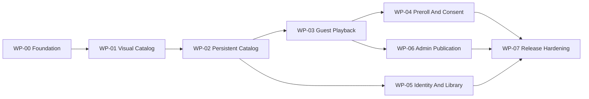

# Delivery Plan

Status: **Execution source of truth**  
Active work package: **WP-02 Persistent Catalog And Search**

## Execution Rules

- Work on only the active package unless the owner explicitly changes priority.
- Complete a vertical, demonstrable outcome; do not prebuild abstractions for later packages.
- A checkbox is complete only when its repository evidence exists and the package validation passes.
- Record evidence links and command results in the package's `Evidence` section before activating the next package.
- Any change to product scope, stack, provider, module boundary, or release gate first updates the relevant document and, when required, an ADR.
- Production credentials, real user data, unlicensed assets, and live ad tags are never prerequisites for local or CI completion.

## Dependency Order

WP-05 and WP-06 may proceed in parallel only after their prerequisites pass and the owner explicitly splits work between agents. A single agent handles one package at a time.

## WP-00 Foundation

**Outcome:** A production-shaped, empty Next.js application can be installed, checked, tested, built, and connected to an isolated PostgreSQL database.

### Scope

- [x] Scaffold current stable Next.js App Router with strict TypeScript and pnpm.
- [x] Pin Node/pnpm requirements and commit the lockfile.
- [x] Configure Tailwind CSS v4 and the canonical color/type/spacing tokens.
- [x] Load DM Sans and Source Serif 4 through `next/font/google` at weights 400/700 with swap behavior and Turkish glyph coverage; verify there is no runtime Google Fonts request.
- [x] Configure the single `tr-TR` locale, `<html lang="tr">`, Turkish routes without a locale prefix, and shared deterministic `Intl` formatters; do not add an i18n library.
- [x] Add ESLint, formatting, typecheck, Vitest, Testing Library, and Playwright foundations.
- [x] Add Prisma/PostgreSQL with an initial connection check but no speculative feature tables.
- [x] Add strict server/public environment parsing and a placeholder-only `.env.example`.
- [x] Create health routes, request ID propagation, structured redacted logging, and base Problem Details helpers.
- [x] Add CI for frozen install, lint, typecheck, unit test, database check, build, and one browser smoke test.
- [x] Create the documented module and route directories only when they receive a real file.
- [x] Add a minimal app shell that proves fonts, tokens, metadata, not-found, and global error handling.

### Acceptance

- A clean checkout succeeds with the documented local setup.
- `pnpm lint`, `pnpm typecheck`, `pnpm test`, `pnpm build`, and the smoke test pass.
- `pnpm db:check` proves an isolated PostgreSQL connection and migration status.
- The browser renders a responsive dark shell at 360x800 and 1440x900 with no console or accessibility errors.
- Client bundles contain no server-only environment value.

### Evidence

- Application/toolchain: [`package.json`](../package.json), [`src/app/layout.tsx`](../src/app/layout.tsx), [`src/app/globals.css`](../src/app/globals.css), and [`.github/workflows/ci.yml`](../.github/workflows/ci.yml).
- Configuration/HTTP boundaries: [`.env.example`](../.env.example), [`src/proxy.ts`](../src/proxy.ts), [`src/shared/http/problem-details.ts`](../src/shared/http/problem-details.ts), and health handlers under [`src/app/api/health`](../src/app/api/health).
- Database: [`compose.yaml`](../compose.yaml), [`prisma/schema.prisma`](../prisma/schema.prisma), the empty foundation migration, and PostgreSQL integration coverage in [`tests/integration/database-foundation.test.ts`](../tests/integration/database-foundation.test.ts).
- Browser evidence: [360x800 shell](../tests/e2e/__screenshots__/chromium-mobile/foundation-shell.png) and [1440x900 shell](../tests/e2e/__screenshots__/chromium-desktop/foundation-shell.png), exercised by [`tests/e2e/foundation.spec.ts`](../tests/e2e/foundation.spec.ts).
- Local validation on 2026-07-18: frozen install passed; formatting, lint, and strict typecheck passed; 15 unit/component tests passed; coverage passed at 88.7% statements, 82.85% branches, 90% functions, and 90% lines; 2 PostgreSQL integration tests passed; `db:check` reported one applied migration and current schema; production build passed; 6 Playwright checks passed across both required viewports with no serious/critical axe violations, browser console errors, Google Fonts requests, horizontal overflow, or server-sentinel leakage.
- Security/content impact: no provider or production secret is required or committed; only `NEXT_PUBLIC_SITE_NAME` reaches browser configuration; no film, artwork, playback URL, or feature table exists in WP-00.
- Remote validation: GitHub Actions [CI run 29649763811](https://github.com/onatozmenn/film-platformu/actions/runs/29649763811) passed on Node 24 and PostgreSQL 18.3 for commit `9ab7795`, including frozen install, formatting, lint, typecheck, unit, integration, database, build, and browser gates.

## WP-01 Visual Catalog With Deterministic Fixtures

**Outcome:** Visitors can navigate a polished, responsive home, catalog, search, and film-detail experience using fictional deterministic data.

### Scope

- [x] Build navigation, mobile menu, search layer, footer, buttons, poster item, badges, rating display, state patterns, and image placeholders.
- [x] Build the photographic hero using an explicitly licensed/local fixture and preserve a hint of the next section.
- [x] Build home rows, responsive poster grid, URL-driven catalog filters, search results/suggestions, and film detail.
- [x] Add loading, empty, partial, error, unavailable, offline, keyboard, and reduced-motion behavior.
- [x] Add responsive screenshots and accessibility tests from `docs/05-DESIGN-SYSTEM.md` and `docs/design/SCREEN-BLUEPRINTS.md`.
- [x] Keep all data behind a catalog query port so fixtures can be replaced in WP-02.

### Acceptance

- Home, catalog, search, and detail match Midnight Programme in root `DESIGN.md`, the route composition in `docs/design/SCREEN-BLUEPRINTS.md`, and the executable constraints in `docs/05-DESIGN-SYSTEM.md` at required viewports.
- Search and filters are keyboard operable, URL-backed, and refresh-safe.
- No route loads player, Mux, IMA, auth, or admin code.
- Visual regression, component, accessibility, lint, typecheck, and build checks pass.

### Evidence

- Query boundary and deterministic fixtures: [`src/modules/catalog/application/catalog-query-port.ts`](../src/modules/catalog/application/catalog-query-port.ts), [`src/modules/catalog/application/catalog-queries.ts`](../src/modules/catalog/application/catalog-queries.ts), and [`src/modules/catalog/infrastructure/fixture-catalog-query.ts`](../src/modules/catalog/infrastructure/fixture-catalog-query.ts).
- Public routes and UI: [`src/app/(public)`](../src/app/(public)), [`src/modules/catalog/ui`](../src/modules/catalog/ui), and the strict suggestion handler at [`src/app/api/v1/search/suggestions/route.ts`](../src/app/api/v1/search/suggestions/route.ts).
- Local imagery: four vendored Library of Congress photographs with source/right statements in [`public/fixtures/catalog/ATTRIBUTION.md`](../public/fixtures/catalog/ATTRIBUTION.md); six films deliberately exercise the typographic missing-art placeholder.
- Representative visual evidence: [mobile home](../tests/e2e/__screenshots__/chromium-mobile/home-discovery.png), [desktop home](../tests/e2e/__screenshots__/chromium-desktop/home-discovery.png), [mobile filter sheet](../tests/e2e/__screenshots__/chromium-mobile/catalog-filter-sheet.png), [empty catalog](../tests/e2e/__screenshots__/chromium-desktop/catalog-empty.png), [search suggestions](../tests/e2e/__screenshots__/chromium-mobile/search-suggestions.png), [search results](../tests/e2e/__screenshots__/chromium-desktop/search-results.png), [long unavailable detail](../tests/e2e/__screenshots__/chromium-mobile/detail-long-unavailable.png), [partial detail](../tests/e2e/__screenshots__/chromium-desktop/detail-partial.png), [ranked rail](../tests/e2e/__screenshots__/chromium-desktop/rail-ranked.png), and [focused rail end](../tests/e2e/__screenshots__/chromium-desktop/rail-end-focus.png). Tablet and wide equivalents are committed beside them.
- Local validation on 2026-07-18: frozen install, formatting, zero-warning lint, strict typecheck, and production build passed; 49 unit/component/route tests passed; coverage passed at 85.63% statements, 77.15% branches, 86.46% functions, and 86.01% lines; 2 PostgreSQL foundation tests and `db:check` passed; 34 Playwright checks passed across 360x800, 768x1024, 1440x900, and 1920x1080 with 10 intentional viewport skips.
- Accessibility/state evidence: axe reported no serious/critical issue; browser checks cover keyboard suggestions, responsive sheets, focus return, rail beginning/middle/end/rank/focus, 320 CSS-pixel long-title fit, reduced motion, offline content preservation, loading/empty/partial/unavailable states, image load, and horizontal overflow.
- Performance/bundle evidence: [`scripts/check-client-budgets.ts`](../scripts/check-client-budgets.ts) measured actual production Chromium requests at 160.2 KB gzip JavaScript and 7.4 KB gzip CSS for home, catalog, search, and detail. Public bundle checks found no Mux Player, Google IMA, or Auth.js code.
- Security/content impact: URL, slug, suggestion limit, and API payload boundaries are validated; search suggestions expose only the owned public contract; all fixture films/people are fictional; no provider ID, stream, production credential, feature table, or arbitrary remote image URL was added.
- Known WP-02 boundary: public reads still use the fixture adapter; catalog persistence, publication visibility policy, database search, cache tags, and TMDB adapter remain blocked until WP-01 remote CI passes and WP-02 activates.
- Remote validation: GitHub Actions [CI run 29656587853](https://github.com/onatozmenn/film-platformu/actions/runs/29656587853) passed on Node 24 and PostgreSQL 18.3 for commit `91d5f59`, including frozen install, formatting, lint, typecheck, unit/coverage, integration, database, production build, public-route asset budgets, and the four-viewport browser suite.

## WP-02 Persistent Catalog And Search

**Outcome:** Public discovery reads published catalog data from PostgreSQL with deterministic seeds and cache invalidation boundaries.

### Scope

- [x] Implement catalog schema, migrations, constraints, indexes, and fictional seed data from `docs/03-DOMAIN-AND-DATA.md`.
- [x] Implement catalog repositories, read models, publication visibility policy, pagination, filters, and PostgreSQL title/person search.
- [x] Replace UI fixtures through the existing query port without changing page contracts.
- [x] Add TMDB metadata adapter behind a disabled-by-default server configuration using provider test fixtures.
- [x] Add public cache tags and invalidation service boundaries; keep draft and member data uncached.
- [x] Add empty-to-current migration tests and repository/query integration tests.

### Acceptance

- Draft and scheduled content never appears in public rows, search, sitemap, or metadata.
- Seeded public journeys behave identically through database-backed queries.
- Search relevance and p95 fixture performance meet the documented budget.
- Migrations, constraints, integration tests, lint, typecheck, build, and browser discovery journey pass.

### Evidence

- Persistence and seed: [`prisma/schema.prisma`](../prisma/schema.prisma), [`prisma/migrations/20260718185925_persistent_catalog/migration.sql`](../prisma/migrations/20260718185925_persistent_catalog/migration.sql), and [`prisma/seed.ts`](../prisma/seed.ts) define the additive catalog model, reviewed PostgreSQL checks/indexes, ten public fictional films, and four concealed lifecycle fixtures.
- Public query path: [`src/modules/catalog/infrastructure/prisma-catalog-query.ts`](../src/modules/catalog/infrastructure/prisma-catalog-query.ts) applies one publication predicate to home, catalog, detail, title/original-title/person search, and suggestions; [`src/shared/pagination/page.ts`](../src/shared/pagination/page.ts) bounds catalog/search pages at 24 records while preserving validated URL state.
- Provider/cache boundaries: [`src/modules/catalog/application/metadata-provider-port.ts`](../src/modules/catalog/application/metadata-provider-port.ts), the synthetic-fixture-tested TMDB adapter, disabled factory, server composition, public cache tags, and [`src/modules/catalog/infrastructure/next-catalog-cache.ts`](../src/modules/catalog/infrastructure/next-catalog-cache.ts). `TMDB_ENABLED` defaults to `false`; token presence alone cannot make a request.
- Database evidence: [`tests/integration/catalog-migration.test.ts`](../tests/integration/catalog-migration.test.ts) replays empty-to-current migration in an isolated schema; [`tests/integration/catalog-repository.test.ts`](../tests/integration/catalog-repository.test.ts) covers hidden lifecycle states, constraints/indexes, deterministic mapping, bounded pagination, title/original-title/person relevance, and warm suggestion p95 below 250 ms.
- Local validation on 2026-07-18: formatting, zero-warning lint, strict typecheck, and production build passed; 69 unit/component/provider tests passed; 10 PostgreSQL migration/repository tests passed after deterministic reseeding; `db:check` reported two applied migrations and current schema; 38 Playwright checks passed across four viewports with 10 intentional skips; production routes measured 160.3 KB gzip JavaScript and 7.4 KB gzip CSS against 180/60 KB budgets.
- Migration/operations impact: the migration is additive, enables `pg_trgm` in `public`, and needs no data backfill from the empty WP-00 schema. Constraint/index failures use a forward-fix migration; production rollout should observe migration lock duration and search latency. The supported test command now migrates and deterministically reseeds only a database ending in `_test`.
- Security/content impact: draft, scheduled, future-publish, and unpublished records are absent from rows, search, suggestions, metadata, sitemap, and detail responses; hidden detail transport returns HTTP 404. TMDB accepts numeric IDs rather than arbitrary URLs, stores provider paths rather than credentials, uses a server-only authorization header, and exposes only coarse typed failures. No live provider call, production token, unlicensed image, or stream is required.
- Remote validation: pending the WP-02 commit CI run; WP-03 remains blocked until it passes.

## WP-03 Licensed Guest Playback

**Outcome:** A visitor can play a watchable seeded film through Mux signed playback without an account.

### Scope

- [ ] Implement video asset, subtitle, content-right, and webhook-idempotency records and migrations.
- [ ] Implement pure watchability policy with injected clock and trusted territory resolver.
- [ ] Implement `VideoProvider`, Mux adapter, deterministic fake, playback-session endpoint, and private/no-store response policy.
- [ ] Build the 16:9 watch experience with Mux Player, captions, loading, denied, provider-error, and retry behavior.
- [ ] Implement verified/idempotent Mux webhook state mapping.
- [ ] Add token-leak, rights-boundary, territory, asset-state, webhook, CSP, and player browser tests.

### Acceptance

- All watchability policy branches pass, including exact time boundaries.
- Eligible visitor playback works with provider fake and staging Mux; ineligible playback fails closed with safe copy.
- Signed grants expire within policy and never appear in logs, URL, analytics, or persistent browser storage.
- Invalid or duplicate webhooks cannot corrupt asset state.
- Watch-page accessibility, responsive screenshots, nonblank-player checks, lint, typecheck, tests, and build pass.

### Evidence

Blocked by WP-02.

## WP-04 Preroll Advertising And Consent

**Outcome:** An eligible playback session offers at most one consent-aware Google IMA preroll and always reaches content when the ad path is unavailable.

### Scope

- [ ] Record the legally reviewed consent-management decision in a new ADR before production behavior is enabled.
- [ ] Implement owned ad-decision types, server-side sanitized configuration, Google IMA adapter, and deterministic fake.
- [ ] Load ad code only after consent and only on the watch route.
- [ ] Implement personalized-denied mode, test-tag environments, empty-ad/error/timeout/blocked paths, and no-retry rule.
- [ ] Add coarse privacy-safe ad outcome telemetry and CSP updates.
- [ ] Add consent, storage, fail-open, bundle-boundary, and browser player/ad handoff tests.

### Acceptance

- Missing or denied advertising consent initializes no optional ad request/storage.
- Non-personalized consent produces only the approved request mode.
- No playback session gets more than one preroll opportunity; no midroll/postroll/overlay exists.
- Every ad failure path reaches eligible content without a loop or blank player.
- Production ad tags cannot load in local, test, or preview environments.

### Evidence

Blocked by WP-03 and owner/legal CMP decision.

## WP-05 Optional Identity And Member Library

**Outcome:** A visitor may become a member and synchronize watchlist, half-star ratings, and viewing progress without changing guest playback eligibility.

### Scope

- [ ] Implement Auth.js database sessions and a testable email-link provider adapter.
- [ ] Implement profile/role, watchlist, rating, and progress schemas, constraints, repositories, and services.
- [ ] Build sign-in callback/error, account, list, rating, continue-watching, clear-history, and sign-out experiences.
- [ ] Implement throttled progress writes plus pause/visibility/page-exit flush behavior.
- [ ] Implement immediate session revocation/account disablement, irreversible deletion requests, the idempotent 30-day purge command, and authenticated `/api/internal/run-retention` transport.
- [ ] Add ownership, CSRF, stale-progress, completion, idempotency, session, privacy, accessibility, and member browser tests.

### Acceptance

- Guest playback still succeeds with auth provider unavailable.
- Cross-user access is denied in application and query predicates.
- Member actions persist across refresh/device sessions in tests; stale updates do not regress progress.
- Email-link responses do not enumerate accounts and tokens never leak.
- Member journey, security matrix, migrations, lint, typecheck, tests, and build pass.

### Evidence

Blocked by WP-02.

## WP-06 Admin Publication And Audit

**Outcome:** Editors and admins can safely take a film from draft to published and reverse it with complete authorization and audit evidence.

### Scope

- [ ] Implement typed admin commands, optimistic revisions, editorial forms, collections, credits, and preview.
- [ ] Implement asset attach/reconcile, subtitle metadata, rights windows, scheduling, publication, and unpublication workflows.
- [ ] Implement authenticated Vercel Cron invocation of the bounded/idempotent `PublishDueMovies` command, including system audit and failed-row retry behavior.
- [ ] Implement role management with final-admin protection.
- [ ] Implement immutable audit records and redacted audit viewer.
- [ ] Add publication completeness, transaction, concurrency, authorization, audit, and admin browser tests.

### Acceptance

- Editor/admin capabilities exactly match the authorization matrix.
- Invalid completeness, rights, schedule, or asset states cannot publish through UI or direct command calls.
- Rights/role/publication mutations and audit events are atomic.
- Early, duplicate, overlapping, and failed scheduled runs preserve state; an eligible exact-due film publishes once.
- Published changes invalidate the intended public cache only after commit.
- Admin journey, migrations, accessibility smoke, lint, typecheck, tests, and build pass.

### Evidence

Blocked by WP-03.

## WP-07 Production Hardening And Launch

**Outcome:** The product is deployable, observable, recoverable, legally configured, and demonstrably passes all release gates.

### Scope

- [ ] Finalize brand assets/copy, production metadata, legal pages, support/takedown route, and TMDB attribution.
- [ ] Configure isolated production database, Mux, email, ad, consent, telemetry, domain, CSP, HSTS, rate limits, and secret manager values.
- [ ] Configure and monitor production scheduled-publication and daily retention cron invocations with a dedicated secret.
- [ ] Add deployment migration job, backup/restore verification, retention/deletion jobs, alerts, dashboards, and runbook links.
- [ ] Run dependency, secret, rights, privacy, accessibility, visual, performance, migration, restore, and full browser checks.
- [ ] Perform staging launch rehearsal, rollback/forward-fix exercise, and owner acceptance.

### Acceptance

- Every owner input in `docs/01-PRODUCT.md` is resolved and documented without committing secrets.
- Required security tests and all quality gates pass; no critical/high release-blocking finding remains.
- A backup restore and account-deletion replay are demonstrated in a non-production environment.
- Alerts reach an owner, runbooks are executable, and rollback/forward-fix paths are rehearsed.
- Every playable production title has verified rights, territory, dates, ready asset, attribution, and owner approval.

### Evidence

Blocked by WP-04, WP-05, and WP-06.

## Deferred Backlog

These require separate product approval and ADRs after MVP evidence: midroll advertising, subscriptions/payments, DRM titles, public reviews, casting, offline playback, multi-region storefronts, dedicated search service, queues/workers, recommendation models, and native apps.
